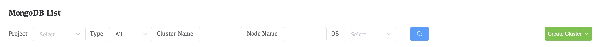
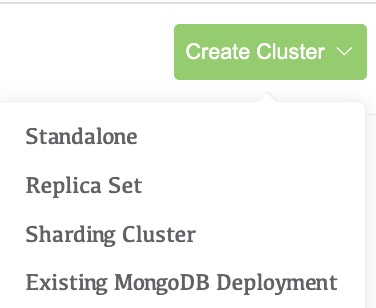
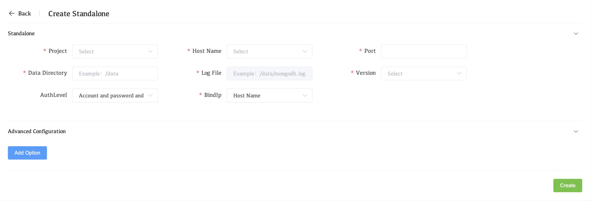

# Deploy a Standalone MongoDB Instance

Whaleal provides a wizard for adding your existing MongoDB deployments to monitoring and management. The wizard prompts you to:

- Install the Agent if you don't have it installed
- Identify the sharded cluster, the replica set, or the standalone to add. You can choose to add the deployment to Monitoring or to both Monitoring and Automation.

## Procedure

### Navigate to the **Processes** tab for your deployment.

1. If it is not already displayed, select the organization that contains your desired project from the **Organizations** menu in the navigation bar.
2. If it is not already displayed, select your desired project from the **Projects** menu in the navigation bar.
3. Click **Processes** in the sidebar.

### Choose **New Standalone**.

1. Click the **Create Cluster** dropdown menu.

   

2. Select **Standalone**.

   

### Configure the standalone MongoDB instance.

In the **Process Configuration** section, complete the following fields.

| Setting                              | Description                                                  |
| :----------------------------------- | :----------------------------------------------------------- |
| **Name**                             | Type the name for your standalone MongoDB deployment.        |
| **Version**                          | Select the MongoDB version for your standalone MongoDB deployment. |
| **Auth Schema Version**              | Select the schema for storing the user data for your deployment. MongoDB 3.2 uses a different schema for user data than previous versions. |
| **Feature Compatibility** (Optional) | Select the feature compatibility set. This field appears if your deployment MongoDB version is `3.4` or later. |
| **Hostname**                         | Type the resolvable address for the host serving your MongoDB deployment. This can be a hostname or an IPv4 address. |
| **Port**                             | Type the IANA port number for your MongoDB deployment. The default for MongoDB deployments is `27017`. |
| **DB Directory Path**                | Type the system path to the `database directory` for this deployment. The default is `/data/data_port`. |
| **Log File Path**                    | The log file and data file are in the same directory, and the directory cannot be customized. The default is `/data/data_port/mongodb.log`. |

### Set any Advanced Configuration options for the standalone MongoDB instance.

In the **Advanced Configuration Options** section, add any additional runtime options you want to set for your MongoDB deployment.

To add an option:

1. Click **Add Option**.

   

2. Select a Startup Option.

3. Set an acceptable value for that Startup Option.

### Click **Create**.