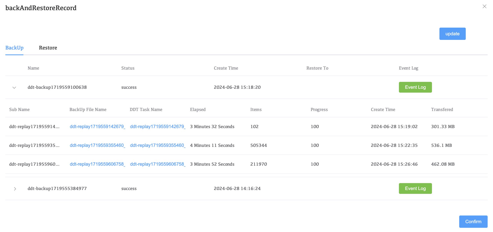
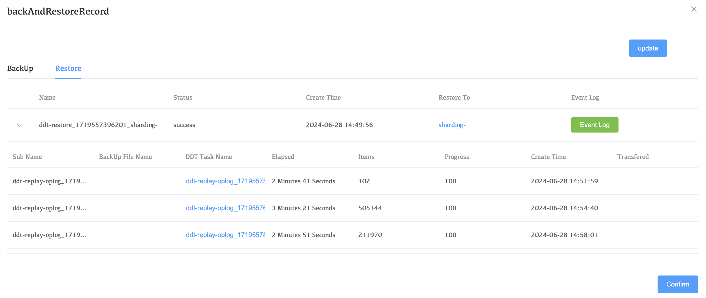

# Operations

## Backup Records

### BackUp

Displays a list of all snapshots, including snapshot files, creation time, expiration time, backup progress and other information of all nodes in the cluster. You can also view the running log of the entire backup cycle through Event Log.

| Parameters           | Description                                                  |
| -------------------- | ------------------------------------------------------------ |
| Sub Name             | Task Name.                                                   |
| **BackUp File Name** | The name and S3 download address of the cluster backup data file. |
| **DDT Task Name**    | DDT backup task log details.                                 |
| Elapsed              | Time to generate backup snapshots.                           |
| Items                | Total number of documents backed up by snapshots.            |
| Progress             | Progress percentage.                                         |
| Create Time          | Snapshot file creation time.                                 |
| Transfered           | Backup file size.                                            |

### Restore

A list of backup data recovery tasks displays all backup and recovery operation records, and contains detailed information about specific tasks, including task execution time, task execution log, etc.

| Parameters       | Description                                        |
| ---------------- | -------------------------------------------------- |
| Sub Name         | Task Name.                                         |
| BackUp File Name | None                                               |
| DDT Task Name    | DDT restore task log details.                      |
| Elapsed          | Time to generate restore snapshots.                |
| Items            | Total number of documents restore up by snapshots. |
| Progress         | progress percentage.                               |
| Create Time      | Snapshot file creation time.                       |
| Transfered       | None                                               |

### update

Update task status. Get the latest backup and restore tasks and task status.

## Take a Snapshot

Restart the new snapshot task and generate a new snapshot. Specific details can be viewed in Backup Records.

## Stop

Stop the backup task.

## Delete

Delete backup policies and clarify all backup data files.

## Rebuild

Rebuild backup tasks and recreate backup snapshots.

## Edit

Modify the backup policy.
