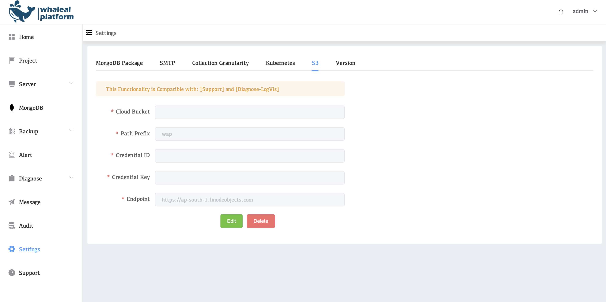

# Configure S3

Configure s3 storage for WAP. Some functions in WAP require s3 configuration to use, such as [Support](../14-Support/01-ClusterInspection.md) and [Diagnose-LogVis](../10-Diagnose/04-LogVis.md). Here is how to configure s3 in the environment

## View s3 Configuration

1. Click on the left side of the setting
2. Click S3

### Parameter Introduction

| Parameters         | Description                                                 |
| ------------------ | ----------------------------------------------------------- |
| **Cloud Bucke**t   | Bucket Name                                                 |
| **Path Prefix**    | Path name, default is wap                                   |
| **Credential ID**  | Access Key ID, used to identify you                         |
| **Credential Key** | The Secret Access Key that is paired with the Access Key ID |
| **Endpoint**       | The endpoint URL of the object storage                      |

